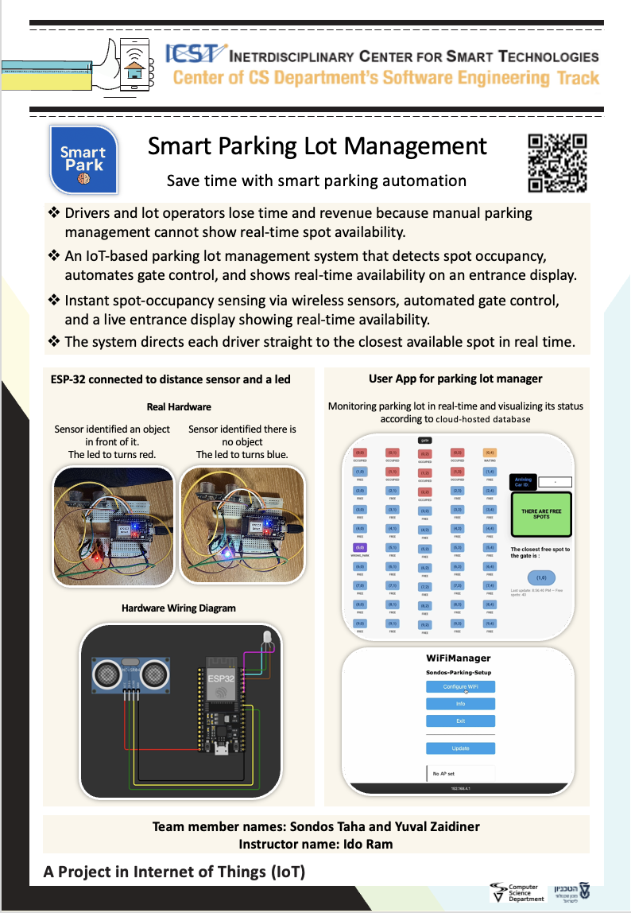

# Smart Parking System Project

## Project by:
* **Sondos Taha**
* **Yuval Zaidner**
---

## Details about the project

An IoT-based smart parking management system that monitors parking spot occupancy in real-time using ESP32 microcontrollers, ultrasonic sensors, and Firebase Realtime Database. The system provides a live web dashboard to visualize parking availability and guides drivers to the nearest free spot using BFS path-finding algorithms.


## Getting started quickly

1. **Skim [`HowToUse.md`](HowToUse.md)** (in the repo root) for the full first-time setup flow (virtualenv, Firebase credentials, dashboard + simulator commands, troubleshooting tips).
2. Follow the **Quick Start – Server/Dashboard** section below if you just need a refresher on the key commands.
3. When in doubt, come back to `HowToUse.md`; it is the source of truth for running the project locally.

**Key Features:**
- Real-time parking spot monitoring with HC-SR04 ultrasonic sensors
- RGB LED status indicators (Blue=Free, Orange=Waiting, Red=Occupied ,Purple=Wrong Spot)
- Firebase Realtime Database for cloud synchronization
- Flask-based web dashboard with live updates
- BFS algorithm for optimal path suggestion to nearest free spot
- Simulation tools for testing and demonstrations

---

## Folder description:

* **ESP32**: Source code for the ESP32 side (firmware). Contains `SpotNode/SpotNode.ino` - the main Arduino sketch for parking spot nodes.
* **Server**: Python Flask web server and backend logic:
  - `dashboard.py` — Web dashboard serving on port 8000
  - `firebase_init.py` — Firebase initialization and authentication
  - `simulation_sondos.py` — Simulation scripts for testing
  - `data_structures.py` — ParkingLot and Spot classes with BFS implementation
  - `static/` and `template/` — Frontend assets (CSS, JavaScript, HTML)
* **Documentation**: Comprehensive guides including:
  - `HowToUse.md` — Hands-on walkthrough for preparing your environment and running the dashboard + simulator.
* **UNIT TESTS**: Tests for individual hardware components and server logic:
  - `ESP32_Tests/` — Arduino test sketches (WiFi, Firebase, Ultrasonic, RGB LED)
  - `Server_Tests/` — Python pytest suite for server components and integration tests
* **Tools**: Utility scripts for setup and simulation
* **Assets**: Project resources:
  - `diagrams/` — Wiring diagrams and system architecture
  - `poster/` — Project presentation poster
  - `screenshots/` — Dashboard and system screenshots


---

## ESP32 SDK version used in this project:

* **ESP32 Arduino Core**: v2.0.14 (by Espressif Systems)
* **Board**: ESP32 DevKit v1 (30-pin)

---

## Arduino/ESP32 libraries used in this project:

* **WiFiManager** - version 2.0.16-rc.2 (by tzapu)
* **Firebase ESP Client** - version 4.3.14 (by mobizt)
* **ArduinoJson** - version 6.21.3 (by bblanchon)
* **WiFi** - Built-in (ESP32 Arduino Core)

---

## Python libraries used in this project:

* **Flask** - version 3.1.2
* **firebase-admin** - version 7.1.0
* **requests** - version 2.32.5
* **pytest** - version 8.4.2

*(See `Server/requirements.txt` for complete dependency list)*

---

## Connection diagram:

### ESP32 to HC-SR04 Ultrasonic Sensor:
```
HC-SR04          →  ESP32
─────────────────────────────
VCC              →  5V
GND              →  GND
TRIG             →  GPIO 5
ECHO             →  GPIO 18
```

### ESP32 to RGB LED (Common Cathode):
```
RGB LED          →  ESP32        
─────────────────────────────────
Red (R)          →  GPIO 23      
Green (G)        →  GPIO 22       
Blue (B)         →  GPIO 21      
Cathode (-)      →  GND           
```

**Full wiring diagram:** See `Assets/diagrams/wiring_diagram.png`

---

## Project Poster:



---

## How to run the code

> 📘 **First-time here?** Start with [`HowToUse.md`](HowToUse.md) for a step-by-step guide to preparing your environment, running the dashboard, and launching the simulator.

### Prerequisites
- Python 3.11+ (tested with 3.13)
- Arduino IDE 1.8.19+ or PlatformIO
- Firebase project with Realtime Database
- ESP32 DevKit v1 board

### Quick Start - Server/Dashboard

1. **Set up Python environment:**
   ```bash
   cd "Server"
   python3 -m venv .venv
   source .venv/bin/activate
   pip install -r requirements.txt
   ```

2. **Configure Firebase credentials:**
   - Place your Firebase service account JSON as `Server/secret.json`, or
   - Set environment variable: `export GOOGLE_APPLICATION_CREDENTIALS="/path/to/secret.json"`

3. **Initialize the parking lot (first time only):**
   ```bash
   python Init_Park.py
   ```

4. **Run the dashboard:**
   ```bash
   python dashboard.py
   ```
   - Open browser: `http://localhost:8000`

### Quick Start - ESP32 Firmware

1. **Install Arduino IDE and ESP32 board support**

2. **Install required libraries:**
   - WiFiManager (2.0.16-rc.2)
   - Firebase ESP Client (4.3.14)
   - ArduinoJson (6.21.3)

3. **Configure and upload:**
   - Open `ESP32/SpotNode/SpotNode.ino`
   - Edit Firebase credentials (API_KEY, DATABASE_URL)
   - Set unique SPOT_PATH for each ESP32 node
   - Upload to ESP32

4. **Connect to WiFi:**
   - ESP32 creates "Sondos-Parking-Setup" hotspot
   - Connect and configure your WiFi credentials

---


## Attribution

This project is part of **ICST - The Interdisciplinary Center for Smart Technologies**  
Taub Faculty of Computer Science, Technion  
https://icst.cs.technion.ac.il/

---
